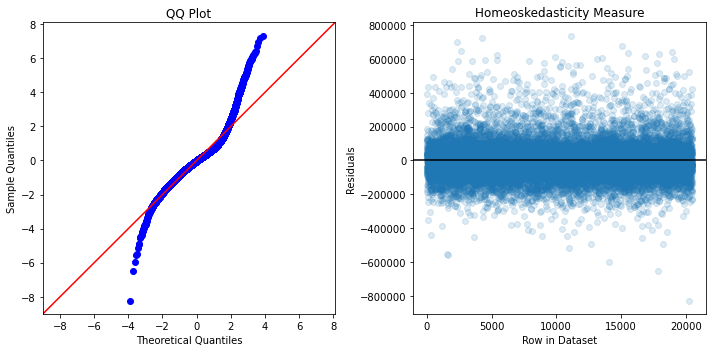

# Predicting Home Prices for Prosepective Sellers

## Introduction
For this investigation, we will be predicting home prices for prospective home sellers in order to give them a solid foundation in the housing market before selling their home. 
## Objectives
- Present a model that our audience can easily use and interpret in order to gain information on their property
- Construct a model with the highest possible R^2 value.
- Provide recommendations to prospective sellers for them to gain a greater context for the housing market beyond predicting prices. 
## Data Overview
Data is collected from Kings County, Washington, from 2014 to 2015. We are provided with:
- Date the home was sold
- Price of the home
- Number of Bedrooms
- Number of Bathrooms
- Home Square Footage
- Lot Square Footage
- Number of Floors
- If the home has a Waterfront View
- Number of times the home was viewed while on the market
- Condition of the home
- Grade of the home, as ranked by Kings County Grading System
- Square Footage of non-basement areas
- Square Footage of the basement
- Year the home was build
- Year the home was renovated
- Home Zipcode
- Latitude
- Longitude
- Square Footage of 15 nearest homes
- Square Footage of 15 nearest lots


## Model Construction Methods
We utilized OLS regression to construct a multilinear regression model. In order to construct a reliable model that was not impacted highly by multicollinearity or other data issues, we first completed:
- Data Cleaning
- Categorical Classification of Columns
- Multicollinearity Checks
### Model 1: Raw Modeling
In order to gain a high level overview of our data, we first completed a baseline model whose data was manipulated as little as possible. This model was unrefined, yet we still acheived an R^2 score of 0.83, as well as low P-Values across our predictors. However, a QQ plot from this model yeilded many issues. Our residuals were not normal at all, and our visualization suggested that this was due the presence of many outliers in our data. 


> This is a raw model used as a basis point from which our refined models will branch from. 

#### Results
- We learned that our data contained many outliers due to our non-linear residuals. 
- Our cleaning, multicollinearity checking, and categorical classification was relatively successful due to low P-values across our predictors. 
- Further data cleaning and transformation is required to construct a more accurate model. 

### Model 2: Refined Modeling
We further refined our data to meet assumptions necessary to complete linear modeling. This section consisted of further data handling through outlier removal, and data transformation. We utilized both Z-Score and IQR outlier removal methods, and continued with Z-Score cleaning after concluding that this method conserved a greater amount of data and yeilded a higher R^2 value than the IQR removal method. 

#### Outlier Removal Models


> This visualization shows the results for data cleaned using Z-Score Outlier Removal methods


> This model used data cleaned through IQR Outlier Removal methods

#### Predictor Transformation Modeling

We also transformed out columns through both a logarithmic and Box-Cox transformation. Based on distribution curves we decided to continue with Box-Cox tranformed data, as this method transformed out data into the most normal distribution we could acheive. 


> This is our final model, with an appropriately accurate R^2 value of 0.87

After these further refinements, our model was improved at the cost of interpretability. Our R^2 value was improved from 0.83 to 0.87, while our P-Values remained in acceptable ranges. A testing validation process was done as well, confirming the viability of our model to predict home prices.

#### Results
- Our data had outliers removed using the Z-Score method becuase less rows were omitted, while maintining a higher R^2 value than using the IQR outlier removal method. 
- Logarithmic transformations were insufficient to fully normalize our data, so we also used a Box-Cox transformation through scipy.stats.boxcox, documentation on this function [here](https://docs.scipy.org/doc/scipy/reference/generated/scipy.stats.boxcox.html)


## Model Conclusions
Our goal in this investigation was twofold; we had to construct a model that could predict prices as accurately as possible, without regard to interpretability, as well as construct a model that would possibly be used by our audience of prospective home sellers. These two goals were completed with different models that we have constructed. Our audience demanding a high R^2 value would prefer our refined model, which has been transformed and manipulated, while prospective home sellers would prefer our outlier removed model for its interpretability and ease of use. 
### Additional Investigations
Model construction does not give a full picture of how our data is interacting. There are an infinite number of inputs to home prices that could be missed when constructing models. We have provided high-level looks at some predictors that would not have been as fleshed out in our formal model investigations. 
#### Consumer Irrationality
Models are built with an underlying assumption of rational behavior, but in large markets this is rarely the case. Indeed, there are many different ways in which irrationality penetrates the housing market, but one of the most easily communicated way is the anchoring effect. 'Anchoring' is a behavioral economics term that explains how a first impression may overwhelm decision making. For our housing example, a prospective home seller may be 'anchored' to the value of their home when they bought it, undervaluing the rise in value of their property, and therefore having an irrational view of their own home's price. To give a high-level investigation of how our data displays the phenomenon of Anchoring, we will use relative square footages of homes. If the square footage of a home increases relative to it's neighbors, the price should also increase.
Furthermore, homes that are higher in square footage than their neighbors should consistently be priced higher than the home of the same square footage, but lower than neighbors' square footage. 

> This graph shows the relationship between price and the ratio between a home's square footage and the average square footage of the nearest 15 neighbors. 


>This graph shows how price varies as square footage increases for two groups: Homes that are lower in square footage than their neighbors, and homes that are higher in square footage than their neighbors. 

##### Conclusions
- As expected, as relative square footage increases, price of the home increases, suggesting that if a home is bigger than its neighbors, it will sell for more. 
- Comparing homes that are larger than neighbors, and homes that are smaller than neighbors, increases in prices actually invert at 3000 square feet. Below this threshold, homes' prices are increased by relatively larger neighbors. Conversely, above 3000 feet, homes prices are inflated by relative size. Both of these scenarios are anchored by neighboring homes. 

#### Housing Density
Another aspect of the housing market that our model did not take into account was home density. How private or public a home is will have a clearly measurable effect on price, yet our model did not reflect this aspect of the housing market. We instead visualized the relationship between price and number of homes within a given Zipcode


>This graph shows the relationship between the number of homes in a given area and the mean price of the homes in this area. 

##### Conclusions
- While a parabolic relationship was calculated, our errors at the extremes suggest that we cannot infer a direct parabolic relationship between housing density and price. 


#### Renovations
We wanted to provide our prospective homeseller with a clearly actionable suggestion, and the most logical suggestion we could make to our prospective sellers is whether or not they should renovate their property. We visualized the relationship between price and the number of years since the most recent construction. 


>This graph shows how a property's price changes as the time since any type of construction passes. 
##### Conclusions
- As expected, there is a terminal value of 60 years that determines the change in price as time passes. If a home has not been renovated in less than 60 years, the price will depreciate. Conversely, if a home has not been renovated in more than 60 years, prices tend to increase as this home reaches an 'antique' status. 

## Project Conclusions and Recommendations

The housing market is one of the most difficult markets to predict, even on as small of a scale of Kings County. For our prospective homesellers, it was important to not only give an accurate model that they could use to predict their homes price, but also give them some context on the housing market through our additional explorations within our data. Through all of this, we would recommend that these prospective homesellers:
- Consider neighbors and their relative sizes compared to your home. If you live in a home that is less than 3000 sqft, it is beneficial to be the smallest house! Conversely, if yoru home is larger than 3000, you would benefit from having a relatively larger house. 
- Consider how a renovation would add considerable value to their home, especially if this home had not been worked on for 55 to 60 years. If a home had a renovation in the past 55 to 60 years, the gain on price would not be as large. Conversely, if the home continued to have no work done past this threshold, it may gain an 'antique' status, increasing the price as time goes on. 

## Next Steps
- A user interface allowing prospective sellers to gain their homes' predicted price would give our audience a clear answer, instead of informing them of trends in predictors versus price. 
- Further data collection should be completed in order to better represent US housing markets. Sampling from a primarily metropolitan area does not represent the market as a whole. 

##### Repository Structure:
```

├── README.md                                                            
├── student.ipynb             
├── column_names.md  
├── CONTRIBUTING.md                 
├── halfway-there.gif             
├── kc_house_data.csv                                     
├── LICENSE.md             
├── mod2_project_rubric.pdf                
└── Images
        ├── Home_Density.png          
        ├── IQR_Model_Measures.png
        ├── Lower_v_Higher.png          
        ├── Raw_Model_Measures.png             
        ├── Relative_Sqft.png                                     
        ├── Renovations.png  
        ├── Transformed_Model_Measures.png
        └── Z_Model_Measures.png

```


